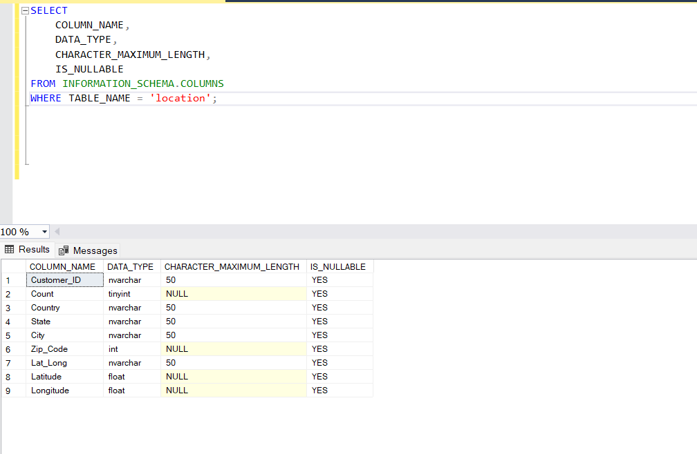
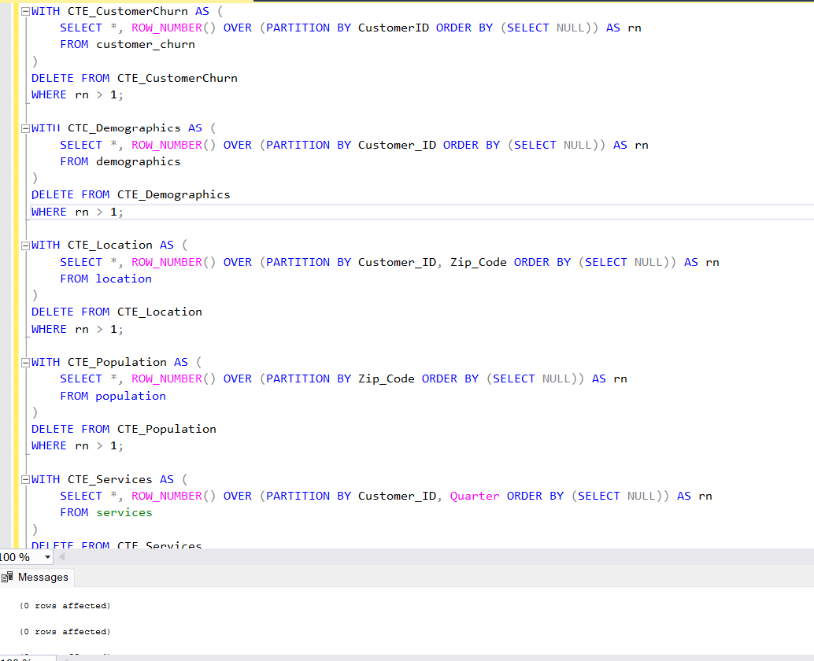
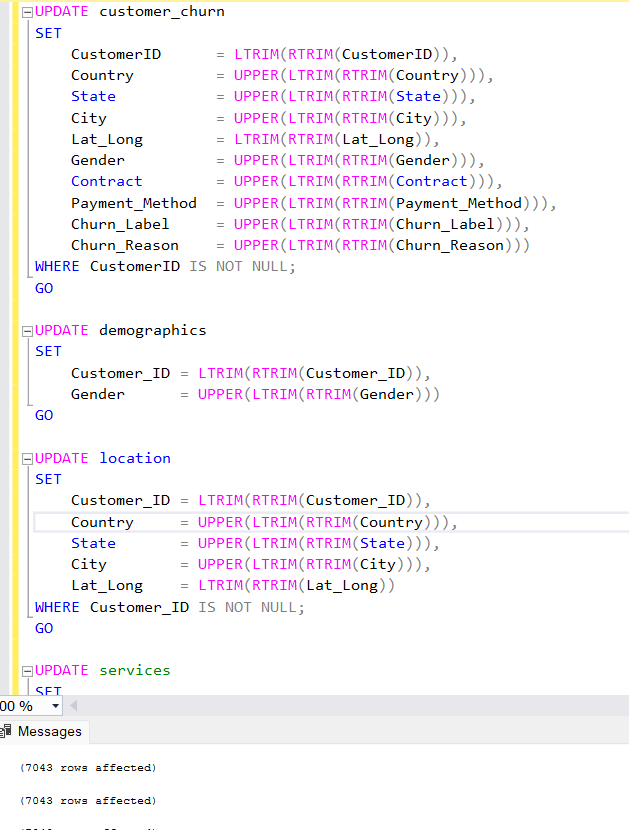

# Customer Churn Analysis Project Documentation

This documentation provides an enterprise-grade overview of the data warehouse project built for analyzing customer churn using the Teleco Customer Churn Dataset. The project was developed following a classical ETL (Extract, Transform, Load) process to create an end-to-end solution—from ingesting raw data to constructing a fully integrated star schema for advanced analytics. The documentation explains every stage and includes insights into data modeling, enrichment, aggregation, and performance optimization.

---

## Table of Contents

1. [Introduction](#introduction)
2. [Data Source Details](#data-source-details)
3. [ETL Process Overview](#etl-process-overview)  
   3.1. [Extraction Process](#extraction-process)  
   3.2. [Transformation Process](#transformation-process)  
   &nbsp;&nbsp;&nbsp;&nbsp;3.2.1. [Table Modifications & Data Cleaning](#table-modifications--data-cleaning)  
   &nbsp;&nbsp;&nbsp;&nbsp;3.2.2. [Data Modeling](#data-modeling)  
   &nbsp;&nbsp;&nbsp;&nbsp;3.2.3. [Data Enrichment / Derived Columns](#data-enrichment--derived-columns)  
   &nbsp;&nbsp;&nbsp;&nbsp;3.2.4. [Creation of Aggregated Tables](#creating-aggregated-tables)  
   &nbsp;&nbsp;&nbsp;&nbsp;3.2.5. [Foreign Key Relationships](#foreign-key-relationships)
4. [Load Process](#load-process)
5. [Conclusion & Next Steps](#conclusion--next-steps)

---

## 1. Introduction

This project centers on the development of a comprehensive data warehouse for customer churn analysis. By integrating various data sources, cleaning, transforming, and enriching the data, we built a star schema that supports dynamic reporting and advanced analytics.

- **Data Origin & Tools:**  
  The raw data is provided in Excel files containing several tables, including customer service details, demographics, location data, population statistics, service usage, and churn status.

- **Analytical Purpose:**  
  The enriched schema facilitates deep analytics on customer behavior, churn trends, revenue generation, and service usage patterns, empowering business intelligence tools (e.g., Power BI, Tableau) to derive actionable insights.

- **End-to-End Solution:**  
  Following a classical ETL methodology, each stage—from data extraction, transformation (including cleaning and data enrichment), to final loading in a star schema—has been designed to ensure data integrity, scalability, and performance.

**Figure 1: Database Diagram after ETL Process**  


---

## 2. Data Source Details

The project uses multiple datasets from the Teleco Customer Churn collection, each focusing on different aspects of the customer experience. Below are the key datasets with the corresponding columns:

### Telco_customer_churn.xlsx
- **Columns:** CustomerID, Count, Country, State, City, Zip Code, Lat Long, Latitude, Longitude, Gender, Senior Citizen, Partner, Dependents, Tenure Months, Phone Service, Multiple Lines, Internet Service, Online Security, Online Backup, Device Protection, Tech Support, Streaming TV, Streaming Movies, Contract, Paperless Billing, Payment Method, Monthly Charges, Total Charges, Churn Label, Churn Value, Churn Score, CLTV, Churn Reason

### Telco_customer_churn_demographics.xlsx
- **Columns:** Customer ID, Count, Gender, Age, Under 30, Senior Citizen, Married, Dependents, Number of Dependents

### Telco_customer_churn_location.xlsx
- **Columns:** Customer ID, Count, Country, State, City, Zip Code, Lat Long, Latitude, Longitude

### Telco_customer_churn_population.xlsx
- **Columns:** ID, Zip Code, Population

### Telco_customer_churn_services.xlsx
- **Columns:** Customer ID, Count, Quarter, Referred a Friend, Number of Referrals, Tenure in Months, Offer, Phone Service, Avg Monthly Long Distance Charges, Multiple Lines, Internet Service, Internet Type, Avg Monthly GB Download, Online Security, Online Backup, Device Protection Plan, Premium Tech Support, Streaming TV, Streaming Movies, Streaming Music, Unlimited Data, Contract, Paperless Billing, Payment Method, Monthly Charge, Total Charges, Total Refunds, Total Extra Data Charges, Total Long Distance Charges, Total Revenue

### Telco_customer_churn_status.xlsx
- **Columns:** Customer ID, Count, Quarter, Satisfaction Score, Customer Status, Churn Label, Churn Value, Churn Score, CLTV, Churn Category, Churn Reason

Each file provides a critical piece of the overall analysis, and the multiple perspectives (demographic, location, service usage, and status) allow for a complete view of the factors contributing to customer churn.

---

## 3. ETL Process Overview

Our ETL pipeline consists of three primary phases: **Extraction**, **Transformation**, and **Load**. Each phase is designed to progressively refine and prepare the dataset for high-performance analytics.

### 3.1 Extraction Process

The extraction phase involves setting up a dedicated database and importing raw data into staging tables.

#### 3.1.1 Creating the Database

The database is created in isolation to manage the project data distinctly from other applications:

```sql
CREATE DATABASE CustomerChurnDB;
GO

USE CustomerChurnDB;
GO
```

- **Explanation:**  
  - `CREATE DATABASE CustomerChurnDB;` provisions a dedicated environment for our project.
  - `USE CustomerChurnDB;` switches the operational context so that all subsequent operations pertain only to this project.

**Figure 1: Database Creation Process**  


#### 3.1.2 Data Import & Initial Data Quality Checks

After creating the database, raw Teleco Customer Churn files (CSV/Excel) are imported into staging tables. Initial descriptive checks are performed to ensure:
- Correct data type mapping.
- No missing or null values.
- Accurate loading of data samples.
- Validation of data integrity using summary statistics.

**Figures 2–7: Overview of Data Import and Quality Checks**  
  
  
  
  
  


---

### 3.2 Transformation Process

In the transformation phase, raw data undergoes cleaning, reformatting, enrichment, and reorganization into an efficient star schema. This section is further divided as follows:

#### 3.2.1 Table Modifications & Data Cleaning

Data cleaning is performed to ensure consistency and data integrity. This includes:

- **Standardizing Data Types & Enforcing Constraints:**  
  Columns are explicitly converted to the proper data type and non-null constraints are enforced.

  ```sql
  ALTER TABLE customer_churn ALTER COLUMN CustomerID NVARCHAR(50) NOT NULL;
  ALTER TABLE customer_churn ALTER COLUMN [Count] TINYINT NOT NULL;
  ALTER TABLE customer_churn ALTER COLUMN Country NVARCHAR(50) NOT NULL;
  ALTER TABLE customer_churn ALTER COLUMN State NVARCHAR(50) NOT NULL;
  ALTER TABLE customer_churn ALTER COLUMN City NVARCHAR(50) NOT NULL;
  ALTER TABLE customer_churn ALTER COLUMN Zip_Code INT NOT NULL;
  ALTER TABLE customer_churn ALTER COLUMN Lat_Long NVARCHAR(50);
  ALTER TABLE customer_churn ALTER COLUMN Latitude FLOAT NOT NULL;
  ALTER TABLE customer_churn ALTER COLUMN Longitude FLOAT NOT NULL;
  ALTER TABLE customer_churn ALTER COLUMN Gender NVARCHAR(50) NOT NULL;
  ```

- **Boolean Data Conversion:**  
  String representations (like `'Yes'` and `'1'`) are converted into BIT values using `UPDATE` statements:
  
  ```sql
  UPDATE customer_churn
  SET Senior_Citizen = CASE WHEN LTRIM(RTRIM(Senior_Citizen)) IN ('Yes', '1') THEN 1 ELSE 0 END;

  UPDATE customer_churn
  SET Partner = CASE WHEN LTRIM(RTRIM(Partner)) IN ('Yes', '1') THEN 1 ELSE 0 END;

  UPDATE customer_churn
  SET Dependents = CASE WHEN LTRIM(RTRIM(Dependents)) IN ('Yes', '1') THEN 1 ELSE 0 END;
  ```

- **Re-defining Boolean Columns:**  
  After conversion, columns are altered to BIT data type to ensure proper usage in further queries.

  ```sql
  ALTER TABLE customer_churn ALTER COLUMN Senior_Citizen BIT NOT NULL;
  ALTER TABLE customer_churn ALTER COLUMN Partner BIT NOT NULL;
  ALTER TABLE customer_churn ALTER COLUMN Dependents BIT NOT NULL;
  ```

**Figure 8: Modified customer_churn Table Structure**  


Similar cleaning steps are followed for the other tables: _demographics, location, population, services,_ and _status_.

**Figures 9–13: Other Tables Modifications**  
  
  
  
  


Additional verification steps are taken to ensure that the data is correctly modified across all tables:

**Figures 14-19: Verifying Tables**  
  
  
  
  
  


---

#### 3.2.2 Data Modeling

The project adopts a star schema that optimizes analytic query performance by separating dimensions from facts. The following dimensions and fact tables have been created:

##### Dim_Customer
Captures personal and demographic data for each customer.
  
```sql
CREATE TABLE Dim_Customer (
  CustomerID NVARCHAR(50) PRIMARY KEY,
  Gender NVARCHAR(50),
  Age TINYINT,
  Senior_Citizen BIT,
  Partner BIT,
  Dependents BIT,
  Married BIT,
  Number_of_Dependents TINYINT
);
```

**Figure 20: `Dim_Customer` Created**  


##### Dim_Location
Contains geographical details along with population data.

```sql
CREATE TABLE Dim_Location (
  LocationID INT IDENTITY(1,1) PRIMARY KEY,
  Zip_Code INT,
  Country NVARCHAR(50),
  State NVARCHAR(50),
  City NVARCHAR(50),
  Latitude FLOAT,
  Longitude FLOAT,
  Population INT
);
```

**Figure 21: `Dim_Location` Created**  


##### Dim_Services
Stores customer service attributes, contract details, and billing information.

```sql
CREATE TABLE Dim_Services (
  ServiceID INT IDENTITY(1,1) PRIMARY KEY,
  CustomerID NVARCHAR(50),
  Phone_Service BIT,
  Multiple_Lines BIT,
  Internet_Service BIT,
  Internet_Type NVARCHAR(50),
  Online_Security BIT,
  Online_Backup BIT,
  Device_Protection_Plan BIT,
  Premium_Tech_Support BIT,
  Streaming_TV BIT,
  Streaming_Movies BIT,
  Streaming_Music BIT,
  Unlimited_Data BIT,
  Contract NVARCHAR(50),
  Paperless_Billing BIT,
  Payment_Method NVARCHAR(50),
  Avg_Monthly_Long_Distance_Charges FLOAT,
  Avg_Monthly_GB_Download TINYINT
);
```

**Figure 22: `Dim_Services` Created**  


##### Dim_Time
Provides a reusable time dimension for date-based analytics.

```sql
CREATE TABLE Dim_Time (
  TimeID INT PRIMARY KEY,
  Date DATE,
  Day INT,
  Month INT,
  MonthName NVARCHAR(20),
  Quarter INT,
  Year INT,
  DayOfWeek INT,
  DayName NVARCHAR(20)
);
```

**Figure 23: `Dim_Time` Created**  


##### Dim_Churn_Status
Stores churn classification or feedback details per customer.

```sql
CREATE TABLE Dim_Churn_Status (
  ChurnStatusID INT IDENTITY(1,1) PRIMARY KEY,
  CustomerID NVARCHAR(50),
  Churn_Category NVARCHAR(50)
);
GO
```

**Figure 24: `Dim_Status` Created**  


##### Fact_Customer_Churn
The central fact table that aggregates measurable business metrics. It links to all dimension tables:

```sql
CREATE TABLE Fact_Customer_Churn (
  FactID INT IDENTITY(1,1) PRIMARY KEY,
  CustomerID NVARCHAR(50),
  LocationID INT,
  ServiceID INT,
  TimeID INT,
  Tenure_Months TINYINT,
  Monthly_Charges FLOAT,
  Total_Charges FLOAT,
  Churn_Score TINYINT,
  CLTV SMALLINT,
  CONSTRAINT FK_Fact_Customer_Churn_Customer FOREIGN KEY (CustomerID) REFERENCES Dim_Customer(CustomerID)
);
```

**Figure 25: `Fact_Customer_Churn` Created**  


---


#### 3.2.3 Data Validation

Validates that key data fields follow the expected business rules (e.g., known gender values):

```sql
UPDATE customer_churn
SET Gender = CASE
  WHEN Gender NOT IN ('MALE','FEMALE') THEN 'UNKNOWN'
  ELSE Gender
END;
GO

UPDATE demographics
SET Gender = CASE
  WHEN Gender NOT IN ('MALE','FEMALE') THEN 'UNKNOWN'
  ELSE Gender
END;
GO
```

**Figure 40: Data validated**  


---

#### 3.2.4 Populating the Star Schema Tables

After cleaning and transforming the data, the next step is to populate the dimension and fact tables.

**Populate `Dim_Customer`**

```sql
MERGE Dim_Customer AS target
USING (
  SELECT DISTINCT
    c.CustomerID,
    COALESCE(d.Gender, c.Gender) AS Gender,
    d.Age,
    c.Senior_Citizen,
    c.Partner,
    c.Dependents,
    d.Married,
    d.Number_of_Dependents
  FROM customer_churn c
  LEFT JOIN demographics d ON c.CustomerID = d.Customer_ID
) AS source
ON target.CustomerID = source.CustomerID
WHEN NOT MATCHED THEN
INSERT (CustomerID, Gender, Age, Senior_Citizen, Partner, Dependents, Married, Number_of_Dependents)
VALUES (source.CustomerID, source.Gender, source.Age, source.Senior_Citizen, source.Partner, source.Dependents, source.Married, source.Number_of_Dependents);
```

**Figure 31: Dim_Customer populated**  


**Populate `Dim_Location`**

```sql
INSERT INTO Dim_Location (Zip_Code, Country, State, City, Latitude, Longitude, Population)
SELECT DISTINCT
  l.Zip_Code,
  l.Country,
  l.State,
  l.City,
  l.Latitude,
  l.Longitude,
  p.Population
FROM location l
LEFT JOIN population p ON l.Zip_Code = p.Zip_Code;
GO
```

**Figure 32: Dim_Location populated**  


**Populate `Dim_Services`**

```sql
INSERT INTO Dim_Services (
  CustomerID,
  Phone_Service,
  Multiple_Lines,
  Internet_Service,
  Internet_Type,
  Online_Security,
  Online_Backup,
  Device_Protection_Plan,
  Premium_Tech_Support,
  Streaming_TV,
  Streaming_Movies,
  Streaming_Music,
  Unlimited_Data,
  Contract,
  Paperless_Billing,
  Payment_Method,
  Avg_Monthly_Long_Distance_Charges,
  Avg_Monthly_GB_Download
)
SELECT DISTINCT
  Customer_ID,
  Phone_Service,
  Multiple_Lines,
  Internet_Service,
  Internet_Type,
  Online_Security,
  Online_Backup,
  Device_Protection_Plan,
  Premium_Tech_Support,
  Streaming_TV,
  Streaming_Movies,
  Streaming_Music,
  Unlimited_Data,
  Contract,
  Paperless_Billing,
  Payment_Method,
  Avg_Monthly_Long_Distance_Charges,
  Avg_Monthly_GB_Download
FROM services;
GO
```

**Figure 33: Dim_Services populated**  


**Populate `Dim_Time`**

```sql
DECLARE @Date DATE = '2010-01-01'
WHILE @Date <= '2030-12-31'
BEGIN
  INSERT INTO Dim_Time (TimeID, Date, Day, Month, MonthName, Quarter, Year, DayOfWeek, DayName)
  VALUES (
    CAST(CONVERT(VARCHAR, @Date, 112) AS INT),
    @Date,
    DAY(@Date),
    MONTH(@Date),
    DATENAME(MONTH, @Date),
    DATEPART(QUARTER, @Date),
    YEAR(@Date),
    DATEPART(WEEKDAY, @Date),
    DATENAME(WEEKDAY, @Date)
  );
  SET @Date = DATEADD(DAY, 1, @Date)
END
```

**Figure 34: Dim_Time populated**  


**Populate `Dim_Status`**

```sql
INSERT INTO Dim_Churn_Status (CustomerID, Churn_Category)
SELECT DISTINCT CustomerID, Churn_Risk_Category
FROM customer_churn;
```

**Figure 35: Dim_Status populated**  


**Populate `Fact_Customer_Churn`**

```sql
INSERT INTO Fact_Customer_Churn (CustomerID, LocationID, ServiceID, TimeID, Tenure_Months, Monthly_Charges, Total_Charges, Churn_Score, CLTV)
SELECT
  c.CustomerID,
  l.LocationID,
  s.ServiceID,
  t.TimeID,
  c.Tenure_Months,
  c.Monthly_Charges,
  c.Total_Charges,
  c.Churn_Score,
  c.CLTV
FROM customer_churn c
LEFT JOIN Dim_Location l ON c.Zip_Code = l.Zip_Code
LEFT JOIN Dim_Services s ON c.CustomerID = s.CustomerID
LEFT JOIN services sv ON c.CustomerID = sv.Customer_ID
LEFT JOIN Dim_Time t ON sv.Quarter = t.Quarter;

UPDATE Fact_Customer_Churn
SET TimeID = CAST(CONVERT(VARCHAR, DATEADD(MONTH, -Tenure_Months, '2025-01-01'), 112) AS INT);

ALTER TABLE Fact_Customer_Churn ADD ChurnStatusID INT;

UPDATE F SET ChurnStatusID = S.ChurnStatusID
FROM Fact_Customer_Churn F JOIN Dim_Churn_Status S ON F.CustomerID = S.CustomerID;
GO
```

**Figure 36: Fact_Customer_Churn populated**  


---

#### 3.2.5 Duplicate Removal

Common Table Expressions (CTEs) are used to identify duplicate rows based on key attributes, then delete any duplicates:

```sql
WITH CTE_CustomerChurn AS (
  SELECT *, ROW_NUMBER() OVER (PARTITION BY CustomerID ORDER BY (SELECT NULL)) AS rn
  FROM customer_churn
)
DELETE FROM CTE_CustomerChurn WHERE rn > 1;

WITH CTE_Demographics AS (
  SELECT *, ROW_NUMBER() OVER (PARTITION BY Customer_ID ORDER BY (SELECT NULL)) AS rn
  FROM demographics
)
DELETE FROM CTE_Demographics WHERE rn > 1;

WITH CTE_Location AS (
  SELECT *, ROW_NUMBER() OVER (PARTITION BY Customer_ID, Zip_Code ORDER BY (SELECT NULL)) AS rn
  FROM location
)
DELETE FROM CTE_Location WHERE rn > 1;

WITH CTE_Population AS (
  SELECT *, ROW_NUMBER() OVER (PARTITION BY Zip_Code ORDER BY (SELECT NULL)) AS rn
  FROM population
)
DELETE FROM CTE_Population WHERE rn > 1;

WITH CTE_Services AS (
  SELECT *, ROW_NUMBER() OVER (PARTITION BY Customer_ID, Quarter ORDER BY (SELECT NULL)) AS rn
  FROM services
)
DELETE FROM CTE_Services WHERE rn > 1;

WITH CTE_Status AS (
  SELECT *, ROW_NUMBER() OVER (PARTITION BY Customer_ID, Quarter ORDER BY (SELECT NULL)) AS rn
  FROM status
)
DELETE FROM CTE_Status WHERE rn > 1;
GO
```

**Figure 37: Duplicates removed**  


#### 3.2.6 Trimming Spaces and Standardizing Text

Removes extra white spaces and converts text to a standard format (typically uppercase):

```sql
UPDATE customer_churn
SET
  CustomerID = LTRIM(RTRIM(CustomerID)),
  Country = UPPER(LTRIM(RTRIM(Country))),
  State = UPPER(LTRIM(RTRIM(State))),
  City = UPPER(LTRIM(RTRIM(City))),
  Lat_Long = LTRIM(RTRIM(Lat_Long)),
  Gender = UPPER(LTRIM(RTRIM(Gender))),
  Contract = UPPER(LTRIM(RTRIM(Contract))),
  Payment_Method = UPPER(LTRIM(RTRIM(Payment_Method))),
  Churn_Label = UPPER(LTRIM(RTRIM(Churn_Label))),
  Churn_Reason = UPPER(LTRIM(RTRIM(Churn_Reason)))
WHERE CustomerID IS NOT NULL;
GO

UPDATE demographics
SET
  Customer_ID = LTRIM(RTRIM(Customer_ID)),
  Gender = UPPER(LTRIM(RTRIM(Gender)))
GO

UPDATE location
SET
  Customer_ID = LTRIM(RTRIM(Customer_ID)),
  Country = UPPER(LTRIM(RTRIM(Country))),
  State = UPPER(LTRIM(RTRIM(State))),
  City = UPPER(LTRIM(RTRIM(City))),
  Lat_Long = LTRIM(RTRIM(Lat_Long))
WHERE Customer_ID IS NOT NULL;
GO

UPDATE services
SET
  Customer_ID = LTRIM(RTRIM(Customer_ID)),
  Quarter = UPPER(LTRIM(RTRIM(Quarter))),
  Offer = LTRIM(RTRIM(Offer)),
  Internet_Type = UPPER(LTRIM(RTRIM(Internet_Type))),
  Contract = UPPER(LTRIM(RTRIM(Contract))),
  Payment_Method = UPPER(LTRIM(RTRIM(Payment_Method)))
WHERE Customer_ID IS NOT NULL;
GO

UPDATE status
SET
  Customer_ID = LTRIM(RTRIM(Customer_ID)),
  Customer_Status = UPPER(LTRIM(RTRIM(Customer_Status))),
  Churn_Label = UPPER(LTRIM(RTRIM(Churn_Label))),
  Churn_Category = UPPER(LTRIM(RTRIM(Churn_Category))),
  Churn_Reason = UPPER(LTRIM(RTRIM(Churn_Reason)))
WHERE Customer_ID IS NOT NULL;
GO
```

**Figure 38: Texts standardized**  


#### 3.2.7 Handling Missing Values

Replaces null values with defaults or computed values to ensure consistency:

```sql
UPDATE customer_churn
SET
  Total_Charges = ISNULL(Total_Charges, 0),
  Churn_Reason = ISNULL(Churn_Reason, 'UNKNOWN');
GO

UPDATE demographics
SET Age = ISNULL(Age, 0);
GO

UPDATE location
SET Zip_Code = ISNULL(Zip_Code, 0);
GO

UPDATE services
SET Offer = ISNULL(Offer, 'NONE');
GO

UPDATE status
SET
  Churn_Category = ISNULL(Churn_Category, 'UNKNOWN'),
  Churn_Reason = ISNULL(Churn_Reason, 'UNKNOWN');
GO
```

**Figure 39: Missing values handled**  


#### 3.2.8 Data Enrichment / Derived Columns

To support richer analysis, several derived columns were added, including:
- **Tenure_Group:** Categorizes customer tenure into groups (e.g., LESS_THAN_1_YEAR, 1_TO_2_YEARS, MORE_THAN_2_YEARS).
- **Revenue_Flag:** Labels customers as 'HIGH_REVENUE' if Monthly Charges exceed a threshold.
- **Churn_Risk_Category:** Classifies churn risk based on the churn score.
- **Customer_Value:** A computed metric representing annual customer revenue.

```sql
IF COL_LENGTH('customer_churn', 'Tenure_Group') IS NULL
BEGIN
  ALTER TABLE customer_churn ADD Tenure_Group NVARCHAR(20);
END;

UPDATE customer_churn
SET Tenure_Group = CASE
  WHEN Tenure_Months < 12 THEN 'LESS_THAN_1_YEAR'
  WHEN Tenure_Months BETWEEN 12 AND 24 THEN '1_TO_2_YEARS'
  ELSE 'MORE_THAN_2_YEARS'
END;

IF COL_LENGTH('customer_churn', 'Revenue_Flag') IS NULL
BEGIN
  ALTER TABLE customer_churn ADD Revenue_Flag NVARCHAR(20);
END;

UPDATE customer_churn
SET Revenue_Flag = CASE
  WHEN Monthly_Charges > 100 THEN 'HIGH_REVENUE'
  ELSE 'NORMAL'
END;

IF COL_LENGTH('customer_churn', 'Churn_Risk_Category') IS NULL
BEGIN
  ALTER TABLE customer_churn ADD Churn_Risk_Category NVARCHAR(20);
END;

UPDATE customer_churn
SET Churn_Risk_Category = CASE
  WHEN Churn_Score >= 80 THEN 'HIGH_RISK'
  WHEN Churn_Score BETWEEN 50 AND 79 THEN 'MEDIUM_RISK'
  WHEN Churn_Score < 50 THEN 'LOW_RISK'
  ELSE 'UNKNOWN'
END;

IF COL_LENGTH('customer_churn', 'Customer_Value') IS NULL
BEGIN
  ALTER TABLE customer_churn ADD Customer_Value FLOAT;
END;

UPDATE customer_churn
SET Customer_Value = Monthly_Charges * 12;
```

**Figure 41: Enriched Tables**  


---
#### 3.2.9 Creating Aggregated Tables

To optimize reporting and analytics, several pre-aggregated tables are built. These tables summarize key metrics such as total monthly charges, total charges, churn rate, and service usage counts.

##### Agg_CustomerChurn_ByCustomer

```sql
IF OBJECT_ID('dbo.Agg_CustomerChurn_ByCustomer', 'U') IS NOT NULL
DROP TABLE dbo.Agg_CustomerChurn_ByCustomer;
GO

CREATE TABLE Agg_CustomerChurn_ByCustomer (
  CustomerID NVARCHAR(50) PRIMARY KEY,
  TotalRecords INT,
  TotalMonthlyCharges FLOAT,
  TotalCharges FLOAT,
  AvgMonthlyCharges FLOAT,
  AvgTotalCharges FLOAT,
  MaxTenureMonths TINYINT,
  MinTenureMonths TINYINT,
  AvgChurnScore FLOAT,
  TotalCLTV SMALLINT,
  ChurnRate FLOAT
);
GO

INSERT INTO Agg_CustomerChurn_ByCustomer (CustomerID, TotalRecords, TotalMonthlyCharges, TotalCharges, AvgMonthlyCharges, AvgTotalCharges, MaxTenureMonths, MinTenureMonths, AvgChurnScore, TotalCLTV, ChurnRate)
SELECT
  f.CustomerID,
  COUNT(*) AS TotalRecords,
  SUM(f.Monthly_Charges) AS TotalMonthlyCharges,
  SUM(f.Total_Charges) AS TotalCharges,
  AVG(f.Monthly_Charges) AS AvgMonthlyCharges,
  AVG(f.Total_Charges) AS AvgTotalCharges,
  MAX(f.Tenure_Months) AS MaxTenureMonths,
  MIN(f.Tenure_Months) AS MinTenureMonths,
  AVG(f.Churn_Score) AS AvgChurnScore,
  SUM(f.CLTV) AS TotalCLTV,
  CAST(SUM(CASE WHEN LOWER(c.Churn_Label) = 'yes' THEN 1 ELSE 0 END) AS FLOAT) / COUNT(*) AS ChurnRate
FROM Fact_Customer_Churn f
JOIN customer_churn c ON f.CustomerID = c.CustomerID
GROUP BY f.CustomerID;
GO
```

**Figure 42: Agg_CustomerChurn_ByCustomer created and populated**  


##### Agg_CustomerChurn_ByLocation

```sql
IF OBJECT_ID('dbo.Agg_CustomerChurn_ByLocation', 'U') IS NOT NULL
DROP TABLE dbo.Agg_CustomerChurn_ByLocation;
GO

CREATE TABLE Agg_CustomerChurn_ByLocation (
  LocationID INT PRIMARY KEY,
  TotalCustomers INT,
  TotalMonthlyCharges FLOAT,
  AvgMonthlyCharges FLOAT,
  TotalCharges FLOAT,
  AvgTotalCharges FLOAT,
  ChurnRate FLOAT
);
GO

INSERT INTO Agg_CustomerChurn_ByLocation (LocationID, TotalCustomers, TotalMonthlyCharges, AvgMonthlyCharges, TotalCharges, AvgTotalCharges, ChurnRate)
SELECT
  l.LocationID,
  COUNT(DISTINCT f.CustomerID) AS TotalCustomers,
  SUM(f.Monthly_Charges) AS TotalMonthlyCharges,
  AVG(f.Monthly_Charges) AS AvgMonthlyCharges,
  SUM(f.Total_Charges) AS TotalCharges,
  AVG(f.Total_Charges) AS AvgTotalCharges,
  CAST(SUM(CASE WHEN LOWER(c.Churn_Label) = 'yes' THEN 1 ELSE 0 END) AS FLOAT) / COUNT(DISTINCT f.CustomerID) AS ChurnRate
FROM Fact_Customer_Churn f
JOIN Dim_Location l ON f.LocationID = l.LocationID
JOIN customer_churn c ON f.CustomerID = c.CustomerID
GROUP BY l.LocationID;
GO
```

**Figure 43: Agg_CustomerChurn_ByLocation created and populated**  


##### Agg_CustomerChurn_ByContract

```sql
IF OBJECT_ID('dbo.Agg_CustomerChurn_ByContract', 'U') IS NOT NULL
DROP TABLE dbo.Agg_CustomerChurn_ByContract;
GO

CREATE TABLE Agg_CustomerChurn_ByContract (
  Contract NVARCHAR(50) PRIMARY KEY,
  TotalCustomers INT,
  TotalMonthlyCharges FLOAT,
  AvgMonthlyCharges FLOAT,
  TotalCharges FLOAT,
  AvgTotalCharges FLOAT,
  ChurnRate FLOAT
);
GO

INSERT INTO Agg_CustomerChurn_ByContract (Contract, TotalCustomers, TotalMonthlyCharges, AvgMonthlyCharges, TotalCharges, AvgTotalCharges, ChurnRate)
SELECT
  s.Contract,
  COUNT(DISTINCT f.CustomerID) AS TotalCustomers,
  SUM(f.Monthly_Charges) AS TotalMonthlyCharges,
  AVG(f.Monthly_Charges) AS AvgMonthlyCharges,
  SUM(f.Total_Charges) AS TotalCharges,
  AVG(f.Total_Charges) AS AvgTotalCharges,
  CAST(SUM(CASE WHEN LOWER(c.Churn_Label) = 'yes' THEN 1 ELSE 0 END) AS FLOAT) / COUNT(DISTINCT f.CustomerID) AS ChurnRate
FROM Fact_Customer_Churn f
JOIN Dim_Services s ON f.ServiceID = s.ServiceID
JOIN customer_churn c ON f.CustomerID = c.CustomerID
GROUP BY s.Contract;
GO
```

**Figure 44: Agg_CustomerChurn_ByContract created and populated**  


##### Agg_CustomerChurn_ByQuarter

```sql
IF OBJECT_ID('dbo.Agg_CustomerChurn_ByQuarter', 'U') IS NOT NULL
DROP TABLE dbo.Agg_CustomerChurn_ByQuarter;
GO

CREATE TABLE Agg_CustomerChurn_ByQuarter (
  TimeID INT PRIMARY KEY,
  Quarter NVARCHAR(50),
  TotalCustomers INT,
  TotalMonthlyCharges FLOAT,
  AvgMonthlyCharges FLOAT,
  TotalCharges FLOAT,
  AvgTotalCharges FLOAT,
  ChurnRate FLOAT
);
GO

INSERT INTO Agg_CustomerChurn_ByQuarter (TimeID, Quarter, TotalCustomers, TotalMonthlyCharges, AvgMonthlyCharges, TotalCharges, AvgTotalCharges, ChurnRate)
SELECT
  t.TimeID,
  t.Quarter,
  COUNT(DISTINCT f.CustomerID) AS TotalCustomers,
  SUM(f.Monthly_Charges) AS TotalMonthlyCharges,
  AVG(f.Monthly_Charges) AS AvgMonthlyCharges,
  SUM(f.Total_Charges) AS TotalCharges,
  AVG(f.Total_Charges) AS AvgTotalCharges,
  CAST(SUM(CASE WHEN LOWER(c.Churn_Label) = 'yes' THEN 1 ELSE 0 END) AS FLOAT) / COUNT(DISTINCT f.CustomerID) AS ChurnRate
FROM Fact_Customer_Churn f
JOIN Dim_Time t ON f.TimeID = t.TimeID
JOIN customer_churn c ON f.CustomerID = c.CustomerID
GROUP BY t.TimeID, t.Quarter;
GO
```

**Figure 45: Agg_CustomerChurn_ByQuarter created and populated**  


##### Agg_ServiceUsage_ByType

```sql
IF OBJECT_ID('dbo.Agg_ServiceUsage_ByType', 'U') IS NOT NULL
DROP TABLE dbo.Agg_ServiceUsage_ByType;
GO

CREATE TABLE Agg_ServiceUsage_ByType (
  Internet_Service_Type NVARCHAR(50) PRIMARY KEY, -- e.g., DSL, FIBER OPTIC, NO INTERNET
  TotalCustomers INT,
  TotalMonthlyRevenue FLOAT,
  AvgMonthlyRevenue FLOAT,
  TotalCharges FLOAT,
  ChurnCount INT,
  NonChurnCount INT,
  ChurnRate FLOAT
);
GO

INSERT INTO Agg_ServiceUsage_ByType (Internet_Service_Type, TotalCustomers, TotalMonthlyRevenue, AvgMonthlyRevenue, TotalCharges, ChurnCount, NonChurnCount, ChurnRate)
SELECT
  s.Internet_Type AS Internet_Service_Type,
  COUNT(DISTINCT f.CustomerID) AS TotalCustomers,
  SUM(f.Monthly_Charges) AS TotalMonthlyRevenue,
  AVG(f.Monthly_Charges) AS AvgMonthlyRevenue,
  SUM(f.Total_Charges) AS TotalCharges,
  SUM(CASE WHEN LOWER(c.Churn_Label) = 'yes' THEN 1 ELSE 0 END) AS ChurnCount,
  SUM(CASE WHEN LOWER(c.Churn_Label) <> 'yes' THEN 1 ELSE 0 END) AS NonChurnCount,
  CAST(SUM(CASE WHEN LOWER(c.Churn_Label) = 'yes' THEN 1 ELSE 0 END) AS FLOAT) / COUNT(DISTINCT f.CustomerID) AS ChurnRate
FROM Fact_Customer_Churn f
JOIN Dim_Services s ON f.ServiceID = s.ServiceID
JOIN customer_churn c ON f.CustomerID = c.CustomerID
GROUP BY s.Internet_Type;
GO
```

**Figure 46: Agg_ServiceUsage_ByType created and populated**  


##### Agg_Demographic_Segmentation

First, a new column is added to the customer dimension to bucket customers by age. Then an aggregated table is created to analyze churn and revenue by demographics.

```sql
IF COL_LENGTH('Dim_Customer', 'Age_Bucket') IS NULL
ALTER TABLE Dim_Customer ADD Age_Bucket NVARCHAR(20);
GO

UPDATE Dim_Customer
SET Age_Bucket = CASE
  WHEN Age < 30 THEN 'UNDER_30'
  WHEN Age BETWEEN 30 AND 50 THEN '30_TO_50'
  ELSE 'OVER_50'
END;
GO

IF OBJECT_ID('dbo.Agg_Demographic_Segmentation', 'U') IS NOT NULL
DROP TABLE dbo.Agg_Demographic_Segmentation;
GO

CREATE TABLE Agg_Demographic_Segmentation (
  Gender NVARCHAR(50),
  Age_Bucket NVARCHAR(20),
  TotalCustomers INT,
  TotalMonthlyRevenue FLOAT,
  AvgMonthlyRevenue FLOAT,
  TotalCharges FLOAT,
  ChurnRate FLOAT
);
GO

INSERT INTO Agg_Demographic_Segmentation (Gender, Age_Bucket, TotalCustomers, TotalMonthlyRevenue, AvgMonthlyRevenue, TotalCharges, ChurnRate)
SELECT
  dc.Gender,
  dc.Age_Bucket,
  COUNT(DISTINCT f.CustomerID) AS TotalCustomers,
  SUM(f.Monthly_Charges) AS TotalMonthlyRevenue,
  AVG(f.Monthly_Charges) AS AvgMonthlyRevenue,
  SUM(f.Total_Charges) AS TotalCharges,
  CAST(SUM(CASE WHEN LOWER(c.Churn_Label) = 'yes' THEN 1 ELSE 0 END) AS FLOAT) / COUNT(DISTINCT f.CustomerID) AS ChurnRate
FROM Fact_Customer_Churn f
JOIN Dim_Customer dc ON f.CustomerID = dc.CustomerID
JOIN customer_churn c ON f.CustomerID = c.CustomerID
GROUP BY dc.Gender, dc.Age_Bucket;
GO
```

**Figure 47: Agg_Demographic_Segmentation created and populated**  


##### Agg_Churn_Trends

This aggregate table summarizes churn trends over time, including customer counts and revenue metrics per quarter.

```sql
IF OBJECT_ID('dbo.Agg_Churn_Trends', 'U') IS NOT NULL
DROP TABLE dbo.Agg_Churn_Trends;
GO

CREATE TABLE Agg_Churn_Trends (
  TimeID INT PRIMARY KEY,
  Quarter NVARCHAR(50),
  TotalCustomers INT,
  ChurnCount INT,
  NonChurnCount INT,
  ChurnRate FLOAT,
  TotalMonthlyRevenue FLOAT,
  TotalCharges FLOAT
);
GO

INSERT INTO Agg_Churn_Trends (TimeID, Quarter, TotalCustomers, ChurnCount, NonChurnCount, ChurnRate, TotalMonthlyRevenue, TotalCharges)
SELECT
  t.TimeID,
  t.Quarter,
  COUNT(DISTINCT f.CustomerID) AS TotalCustomers,
  SUM(CASE WHEN LOWER(c.Churn_Label) = 'yes' THEN 1 ELSE 0 END) AS ChurnCount,
  SUM(CASE WHEN LOWER(c.Churn_Label) <> 'yes' THEN 1 ELSE 0 END) AS NonChurnCount,
  CAST(SUM(CASE WHEN LOWER(c.Churn_Label) = 'yes' THEN 1 ELSE 0 END) AS FLOAT) / COUNT(DISTINCT f.CustomerID) AS ChurnRate,
  SUM(f.Monthly_Charges) AS TotalMonthlyRevenue,
  SUM(f.Total_Charges) AS TotalCharges
FROM Fact_Customer_Churn f
JOIN Dim_Time t ON f.TimeID = t.TimeID
JOIN customer_churn c ON f.CustomerID = c.CustomerID
GROUP BY t.TimeID, t.Quarter;
GO
```

**Figure 48: Agg_Churn_Trends created and populated**  


---

#### 3.2.10 Foreign Key Relationships

To maintain referential integrity and ensure consistency across the star schema, foreign key constraints are defined between the fact table and each dimension table:

```sql
-- Customer
ALTER TABLE Fact_Customer_Churn
ADD CONSTRAINT FK_FactCustomerChurn_DimCustomer
FOREIGN KEY (CustomerID) REFERENCES Dim_Customer(CustomerID);

-- Location
ALTER TABLE Fact_Customer_Churn
ADD CONSTRAINT FK_FactCustomerChurn_DimLocation
FOREIGN KEY (LocationID) REFERENCES Dim_Location(LocationID);

-- Services
ALTER TABLE Fact_Customer_Churn
ADD CONSTRAINT FK_FactCustomerChurn_DimServices
FOREIGN KEY (ServiceID) REFERENCES Dim_Services(ServiceID);

-- Time
ALTER TABLE Fact_Customer_Churn
ADD CONSTRAINT FK_FactCustomerChurn_DimTime
FOREIGN KEY (TimeID) REFERENCES Dim_Time(TimeID);

-- Churn Status
ALTER TABLE Fact_Customer_Churn
ADD CONSTRAINT FK_FactCustomerChurn_DimChurnStatus
FOREIGN KEY (ChurnStatusID) REFERENCES Dim_Churn_Status(ChurnStatusID);
```

**Figure 49: Star Schema Foreign Key Relationships**  


- **Explanation:**  
  These constraints ensure that every record in the fact table references existing records in the dimension tables, thereby enforcing data integrity and supporting robust querying across the schema.

---


## 4. Load Process

In the load phase, the fully transformed and enriched data is moved into the production tables that form the star schema. The main tasks in this phase include:

- **Data Insertion:**  
  The cleaned dimension and fact tables, as well as the pre-aggregated tables, are populated with data from the transformation pipeline.

- **Integrity Enforcement:**  
  Foreign key relationships are enforced, ensuring that all referential constraints between the fact and dimension tables are active.

- **Automation:**  
  Once validated, the ETL process can be scheduled to run automatically for either batch or incremental updates, ensuring that the production environment always reflects the latest data insights.

---

## 5. Conclusion & Next Steps

This documentation has provided a detailed, step-by-step guide to building an enterprise-grade data warehouse for customer churn analysis. In summary:

- **ETL Pipeline:**  
  The process is divided into extraction (data ingestion), transformation (cleaning, enrichment, and modeling), and load (insertion into production tables).

- **Data Quality:**  
  Extensive cleaning, duplicate removal, and data validation steps have been implemented to ensure the quality and consistency of the dataset.

- **Data Enrichment:**  
  Derived columns and additional attributes were added to enhance the analytic capabilities.

- **Data Modeling:**  
  A star schema has been constructed with clearly defined dimension and fact tables. Pre-aggregated tables have been created to improve query performance, and foreign key constraints ensure referential integrity.

- **Future Enhancements:**  
  Recommended next steps include further performance tuning, adding new data sources, real-time data feeds, and deeper statistical analysis to refine predictive models for customer churn.

The entire process, as outlined above, enables robust business intelligence reporting and deep dive analytics, forming a complete end-to-end solution for understanding and addressing customer churn.

---
